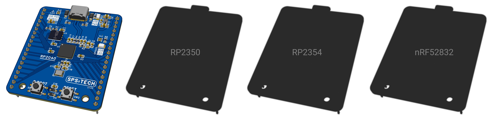

# Coreboards
An interchangeable MCU modules implementing a defined hardware interface to unify development with compatible carrier boards.




## Roadmap

There are several modules ahead)

| RP2040                      | RP2350                         | RP2354                         | nRF52832                       |
|-----------------------------|--------------------------------|--------------------------------|--------------------------------|
|  |  |  |  |

---

## Board namespace

General pattern
```
<project>.<category><id>.<descriptor>.v<rev>
```

Description

| Part       | Meaning              | Example                    |
|------------|----------------------|----------------------------|
| project    | project              | `coreboards`               |
| category   | hardware class       | `mod`, `pba`, `pcb`, `asm` |
| id         | sequential family ID | `001`                      |
| descriptor | role / MCU / subtype | `eval`, `rp2040`           |
| v<rev>     | revision             | `v01`, `v02`               |
